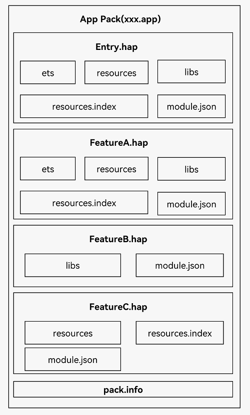

## AppScope目录
  ### app.json5​​
  配置应用全局描述信息，例如应用包名、版本号、应用图标、应用名称和依赖的SDK版本号等。
  ### resources
  放置应用的图标资源和应用名称字符串资源。
  
  ## Entry目录
  Entry类型的HAP：是应用的主模块，在​​module.json5配置文件​​中的type标签配置为“entry”类型。在同一个应用中，同一设备类型只支持一个Entry类型的HAP，通常用于实现应用的入口界面、入口图标、主特性功能等。

Feature类型的HAP：是应用的动态特性模块，在​​module.json5配置文件​​​中的type标签配置为“feature”类型。一个应用程序包可以包含一个或多个Feature类型的HAP，也可以不包含；Feature类型的HAP通常用于实现应用的特性功能，可以配置成按需下载安装，也可以配置成随Entry类型的HAP一起下载安装（请参见​​module对象内部结构​​中的“deliveryWithInstall”）。
  
-------

## 应用包结构
打包后的HAP包结构包括ets、libs、resources等文件夹和resources.index、module.json、pack.info等文件。
1. ets目录用于存放应用代码编译后的字节码文件。
2. libs目录用于存放库文件。库文件是HarmonyOS应用依赖的第三方代码（例如.so、.jar、.bin、.har等二进制文件）。
3. resources目录用于存放应用的资源文件（字符串、图片等），便于开发者使用和维护，详见​​资源文件的使用​​。
1. resources.index是资源索引表，由IDE编译工程时生成。
2. module.json是HAP的配置文件，内容由工程配置中的module.json5和app.json5组成，该文件是HAP中必不可少的文件。IDE会自动生成一部分默认配置，开发者按需修改其中的配置。详细字段请参见​​应用配置文件​​。
3. pack.info是Bundle中用于描述每个HAP属性的文件，例如app中的bundleName和versionCode信息、module中的name、type和abilities等信息，由IDE工具生成Bundle包时自动生成。
`
